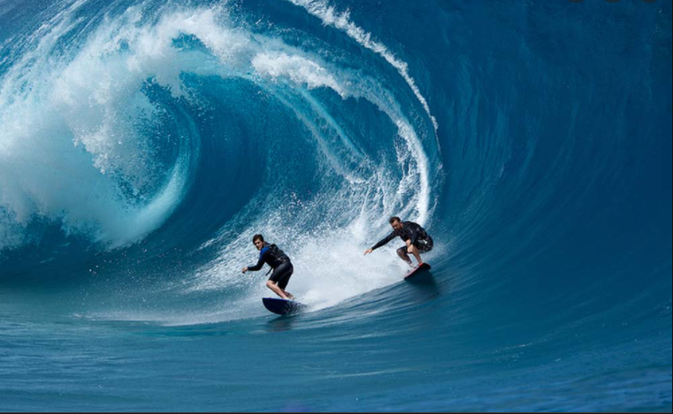
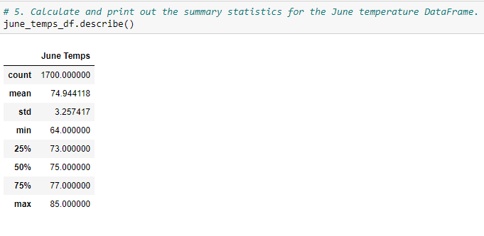
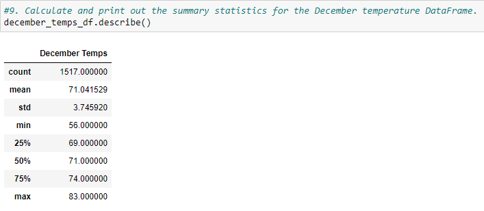
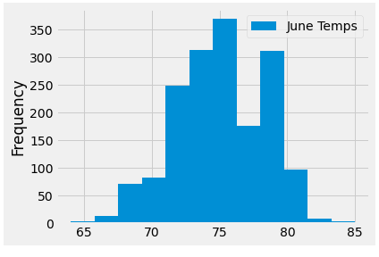
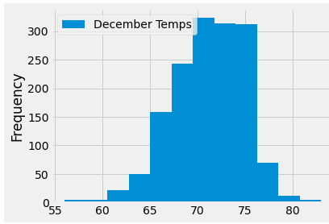

# Surfs_Up 
  

## Background 

W. Avy has appreciated the analysis, but he wants more information about temperature trends before opening the surf shop. Specifically, he wants temperature data for the months of June and December in Oahu, to determine if the surf and ice cream shop business is sustainable year-round.  

## Overview of the Analysis  
**Approach** 

Using Python, Pandas functions and methods, and SQLAlchemy, I have filtered the date column of the Measurements table in the hawaii.sqlite database to retrieve all the temperatures for the month of June and December. I then converted those temperatures to a list, created a DataFrame from said list, and have generated a summary statistics. 

**Goal** 
Remembering back to previous conversations with W. Avy, has mentioned in the past that he does not just want to see a list of data results; he wants to understand trends in the data.  In that manner, I agree with W. Avy that the overall goal is to provide insight into the weather/temperature patterns of a specific location on Oahu where he would like to build his shop. I created a histogram from the temperature observations as thhis will allow us to quickly count how many temperature observations we have.  This information paired alongside the data statistics will provide insight through visualization of the temperature analysis. 

Let's not forget, the goal of the exercise is not just to crunch the numbers — it is to deliver W. Avy with facts to solidfy his impending decision and investment.  

## Results  

The results show for June that the low (minimum) temperature is 64 degrees, the high (maximum) temperature is 85 degrees, and the average temperature is ~ 75 degrees.   

 

Furthermore, the results show for December that the low (minimum) temperature is 56 degrees, the high (maximum) temperature is 83 degrees, and the average temperature is ~ 71 degrees. 

 

Looking at this plot, we can infer that a vast majority of the observations are over 65 degrees.   Because of that, let's dive into the statistical data we have complied for him pertaining to the months of June and December.  

 

While this data shows all the station observations, we are interested in determining temperature trends.  One trend we can observe based on this plot is that some months have higher temperatures than others.  

  

## Summary  
This will help solidify a repeatable process and make it easier to run this analysis again — for example, when we need to figure out where to open our second surf and ice cream shop.  Now, let us think about precipitation. There needs to be enough rain to keep everything green, but not so much that you lose out on that ideal surfing and ice cream weather.  You know that you can set W. Avy's mind at ease by analyzing precipitation levels and showing him the cold, hard, data that backs up Oahu as the perfect place to surf. You have the last 12 months of precipitation data already loaded into your SQLite database, so you are ready to go.  W. Avy supplied you with the data he wants us to use and has asked you to look at a full year of data. When deciding how to parse the data, you remember that his favorite day is August 23, 2017 because it's the anniversary of the first time he ever went surfing and had ice cream on the same day.

